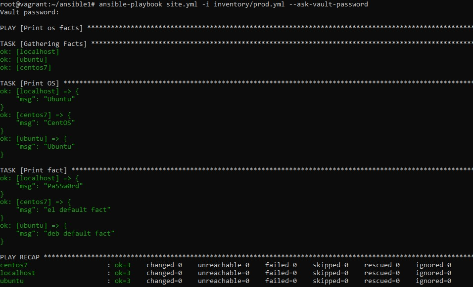

# Самоконтроль выполненения задания

1. Где расположен файл с `some_fact` из второго пункта задания?  
`some_fact` расположен в файле group_vars/all/examp.yml
2. Какая команда нужна для запуска вашего `playbook` на окружении `test.yml`?  
`ansible-playbook site.yml -i inventory/test.yml`
3. Какой командой можно зашифровать файл?  
`ansible-vault encrypt <файл>`
4. Какой командой можно расшифровать файл?  
`ansible-vault decrypt <файл>`
5. Можно ли посмотреть содержимое зашифрованного файла без команды расшифровки файла? Если можно, то как?  
`ansible-vault view <файл>`
6. Как выглядит команда запуска `playbook`, если переменные зашифрованы?  
`ansible-playbook site.yml -i inventory/prod.yml --ask-vault-password`
7. Как называется модуль подключения к host на windows?  
`winrm`
8. Приведите полный текст команды для поиска информации в документации ansible для модуля подключений ssh  
`ansible-doc -t connection ssh`
9. Какой параметр из модуля подключения `ssh` необходим для того, чтобы определить пользователя, под которым необходимо совершать подключение?  
`remote_user`

## Необязательная часть

1. При помощи `ansible-vault` расшифруйте все зашифрованные файлы с переменными.  
`ansible-vault decrypt group_vars/deb/examp.yml`
`ansible-vault decrypt group_vars/el/examp.yml`
2. Зашифруйте отдельное значение `PaSSw0rd` для переменной `some_fact` паролем `netology`. Добавьте полученное значение в `group_vars/all/exmp.yml`.  
`ansible-vault encrypt_string 'PaSSw0rd' --name "some_fact"`
3. Запустите `playbook`, убедитесь, что для нужных хостов применился новый `fact`.  
		<!---->
