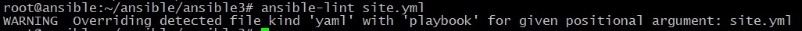
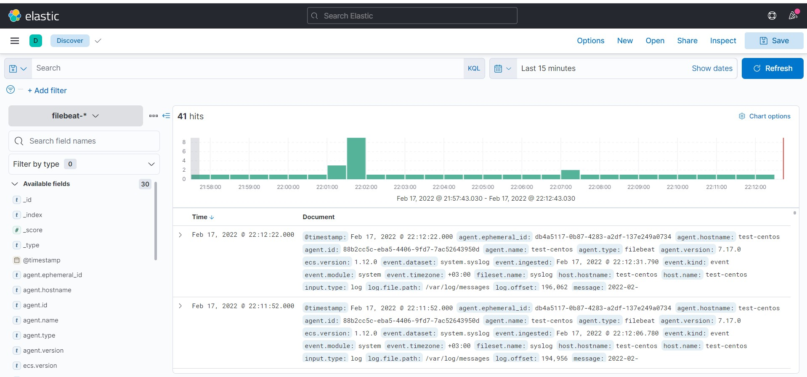

# Домашнее задание к занятию "8.3 Использование Yandex Cloud"

Playbook запускает 3 Play:
1. Install Elasticsearch
2. Install Kibana
3. Install Filebeat

Хосты прописаны в файле `inventory/prod/hosts.yml`.
Переменные, которые используются для всех хостов указаны в файле `inventory/prod/group_vars/all/vars.yml`.

Play **Install Elasticsearch** выполняется для хостов, указанных в группе `elasticsearch`. В нем выполняются следующие tasks:
- **Download Elasticsearch's deb** - загрузка DEB пакета с Elasticsearch с помощью модуля `get_url`. В случае неудачной попытки, повторяет загрузку 3 раза благодаря ключевому слову `until`.
- **Install Elasticsearch** - установка Elasticsearch с помощью модуля APT.
- **Configure Elasticsearch** - настройка файла конфигурации Elasticsearch с помощью модуля `template`.  

Play **Install Kibana** выполняется для хостов, указанных в группе `kbn`. В нем выполняются те же tasks, что и у Play **Install Elasticsearch**.

Play **Install Filebeat** выполняется для хостов, указанных в группе `flbt`. В нем выполняются следующие tasks:
- **Download Filebeat's rpm** - загрузка RPM пакета с Filebeat с помощью модуля `get_url`. В случае неудачной попытки, повторяет загрузку 3 раза благодаря ключевому слову `until`.
- **Install Filebeat** - установка Filebeat с помощью модуля YUM.
- **Configure Filebeat** - настройка файла конфигурации Filebeat с помощью модуля `template`.  
- **Enable the system module** - включение модуля Filebeat System.
- **Loads the Kibana dashboards** - загрузка рекомендуемого шаблона индекса для записи в Elasticsearch и развертываются образцы информационных панелей для визуализации данных в Kibana.  

В каждом Play присутствует Handler, который выполняет перезагрузку сервиса.
Кроме этого в Plays используются параметры `become` для возможности повышения привилегий пользователя.  

Результат выполнения команды `ansible-lint`:  
		<!---->

Результат выполнения Plabook:  
		<!---->