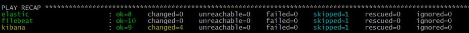

# Домашнее задание к занятию "8.4 Работа с Roles"

Playbook запускает 3 Play, где для каждой группы хостов выполняется определенная роль:
1. Install Elasticsearch
2. Install Kibana
3. Install Filebeat

Хосты прописаны в файле `inventory/prod/hosts.yml`.
Переменные, которые используются для всех хостов указаны в файле `inventory/prod/group_vars/all/vars.yml`.

Play **Install Elasticsearch** выполняется для хостов, указанных в группе `elasticsearch`. Для этих хостов выполняется роль `elastic`, которая скачивается с публичного репозитория, указанного в файле `requirements.yml`.

Play **Install Kibana** выполняется для хостов, указанных в группе `kbn`. Для этих хостов выполняется роль `kibana-role`, которая располагается в директории `roles/`. Данная роль выполняет следующие tasks, которые импортируются и включаются в основной файл `main.yml`:
- **precheck.yml** - проверяет поддерживаемые ОС, которые указаны в файле `vars/main.yml`
- **Check files directory exists** - task, проверяющая наличие директории `files/` на управляющем хосте
- **download_{{ ansible_facts.pkg_mgr }}.yml** - в зависимости от дистрибутива ОС будет скачан установочный пакет
- **install_{{ ansible_facts.pkg_mgr }}.yml** - в зависимости от дистрибутива ОС будет установлен пакет
- **configure.yml** - настройка файла конфигурации Kibana с помощью модуля `template`. Файл с настройками располагается в директории `templates/`  

В файле `defaults/main.yml` указаны переменные версии (kibana_version) и типа установки Kibana (kibana_install_type)
Handlers располагаются в директории `handlers` в файле `main.yml`. Выполняет перезапуск сервиса.

Play **Install Filebeat** выполняется для хостов, указанных в группе `flbt`. Для этих хостов выполняется роль `filebeat-role`, которая располагается в директории `roles/`. Данная роль выполняет те же tasks, что и у роли `kibana-role`, только для RHEL дистрибутивов и добавлены еще 2 tasks:
- **module.yml** - включение модуля Filebeat System.
- **dashboard.yml** - загрузка рекомендуемого шаблона индекса для записи в Elasticsearch и развертываются образцы информационных панелей для визуализации данных в Kibana.

Результат выполнения Plabook:  
		<!---->